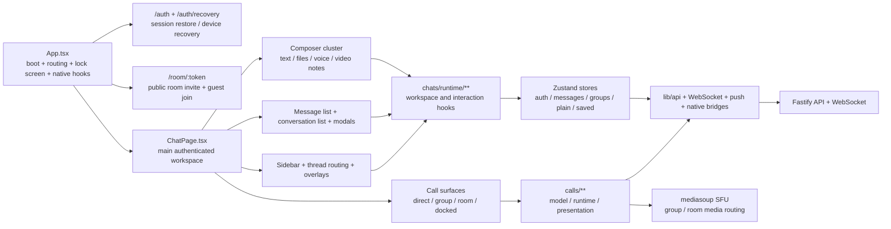

<p align="center">
  
</p>

<h1 align="center">Seclettr</h1>

<p align="center">
  <a href="https://github.com/stepan-pavlenko/seclettr/actions/workflows/ci.yml">
    
  </a>
  <a href="https://github.com/stepan-pavlenko/seclettr/actions/workflows/release-bundle.yml">
    
  </a>
  
  
  = 22" />
  = 11" />
  
  
  
</p>

> Self-hostable messaging and calling stack with encrypted chats, explicit plain-chat flows, direct/group/room calls, and one deployable monorepo for web, API, and SFU services.

> [!IMPORTANT]
> Seclettr is currently `1.3.1-beta` and under active development. The encrypted messaging model is implemented in the client stack, but the server still handles the metadata and transport needed for routing, storage, presence, attachments, and calls. Call media protection depends on the selected call-security mode and on browser/runtime compatibility.

## Why Seclettr

Seclettr is built for teams that want one cohesive stack instead of stitching together separate chat, calling, guest-room, and deployment projects.

What makes it interesting today:

- encrypted direct chats and encrypted group chats live next to explicit plain-chat flows instead of pretending every conversation has the same trust model;
- direct calls, SFU-backed group calls, and shareable guest room calls exist in the same product surface;
- the repo already includes the operational layer: web client, Fastify API, mediasoup SFU, protocol package, crypto package, release bundle flow, and installer modes;
- the web app is not just a desktop browser client: it also has an Android Capacitor shell with native-notification and background-runner integration points.

This is still a beta codebase, but it is already broader than a typical “just encrypted DMs” or “just a call demo” open-source repo.

## Product Preview

<p align="center">
  
</p>

<p align="center">
  <em>Desktop chat workspace from the live development stack.</em>
</p>

<p align="center">
  
  
</p>

<p align="center">
  <em>Composer depth: emoji, attachments, previews, and send-quality controls.</em>
</p>

<p align="center">
  
  
  
</p>

<p align="center">
  <em>Mobile thread view, plain-chat organization actions, and the public room-call entry flow.</em>
</p>

## What Ships Today

### Messaging

- Encrypted 1:1 chats with:
  - delivery and read acknowledgements;
  - typing and presence signals;
  - optimistic local state with reconciliation after server confirmation;
  - attachment, voice-note, and video-note flows.
- Encrypted group chats with:
  - membership and role model (`owner` / `admin` / `member`);
  - sender-key based group-message flows;
  - group history replay and live updates.
- Explicit plain chats and plain groups with their own API/runtime path:
  - plain direct messages;
  - plain group threads;
  - plain attachment endpoints;
  - per-user pins and folders for plain chats/groups.
- Media UX in chat:
  - file attachments;
  - inline image/video rendering;
  - grouped media albums;
  - voice notes;
  - video notes;
  - sender-side and recipient-side attachment runtime.

### Calls

- Direct 1:1 audio/video calls with authenticated signaling.
- Group audio/video calls over a mediasoup-based SFU.
- Standalone room calls with invite links and guest join flow.
- Screen sharing across call surfaces.
- Minimized/docked call surfaces in the web UI.
- Missed-call and call-history event surfaces in chat.
- Call-security mode selection in the client (`compatibility`, `balanced`, `strict`).

### Web and Client Experience

- React + Vite web client with desktop and mobile chat layouts.
- English and Russian localization.
- Browser push notifications with per-category preferences:
  - direct encrypted messages;
  - encrypted group messages;
  - direct call invites;
  - sender visibility in notification text.
- Local app-lock flow with passcode-based lock screen.
- Optional Android shell through Capacitor with:
  - native-notification permission flow;
  - native back-button integration;
  - background unread-check runner hooks;
  - local native storage bridge helpers.

### Backend, Protocol, and Operations

- Fastify API for auth, messaging, groups, attachments, calls, rooms, push, and plain-chat routes.
- Shared protocol package with Zod contracts and TypeScript types used by web, API, and SFU.
- Dedicated crypto package for messaging/session/attachment primitives.
- mediasoup SFU service for group-call media routing.
- Docker-based local development stack.
- Release bundle generation with prebuilt images and installer scripts.
- Health and readiness endpoints plus metrics endpoint.

## Feature Matrix

| Surface | Implemented today |
| --- | --- |
| Encrypted direct messaging | Yes |
| Encrypted group messaging | Yes |
| Plain direct chats | Yes |
| Plain groups | Yes |
| Plain chat pins and folders | Yes |
| File attachments | Yes |
| Voice notes | Yes |
| Video notes | Yes |
| Direct 1:1 calls | Yes |
| SFU-backed group calls | Yes |
| Shareable room calls with guests | Yes |
| Screen sharing | Yes |
| Browser push notifications | Yes |
| Android Capacitor shell hooks | Yes |
| Release bundle / installer flow | Yes |

## Security Model at a Glance

Seclettr should be described carefully, not magically.

- Encrypted messaging:
  - message payload encryption is performed on client devices;
  - direct encrypted messaging uses an X3DH/Double Ratchet-style session stack in the project codebase;
  - encrypted group messaging uses a sender-key style group flow.
- Plain chats:
  - plain DMs and plain groups are explicit product surfaces;
  - they are not the same thing as encrypted chats and should be treated differently operationally and in docs.
- Attachments:
  - encrypted attachment flows exist for encrypted chats;
  - plain attachment flows exist separately for plain chats/groups.
- Calls:
  - the project exposes multiple call-security modes;
  - media protection behavior depends on call mode and browser/runtime support;
  - do not read this README as a promise that every call is always using the strongest media mode on every browser.

What this README is intentionally **not** claiming:

- full metadata privacy;
- full Signal compatibility;
- zero-knowledge auth;
- formally verified cryptography;
- internal service TLS everywhere by default;
- horizontally scalable SFU room-state today.

If you need the deployment path, legal framing, or a more operator-oriented setup guide, use:

- [DEPLOYMENT.md](DEPLOYMENT.md)
- [LEGAL_NOTICE.md](LEGAL_NOTICE.md)
- [THIRD_PARTY_NOTICES.md](THIRD_PARTY_NOTICES.md)

## Quick Start

### One-Line Install (Recommended)

Run this on a fresh server (Ubuntu/Debian, Fedora, RHEL, Alpine). It installs
Docker if needed, downloads the latest release bundle, verifies its SHA-256,
generates secrets and a self-signed TLS certificate, runs migrations, and
starts the full stack.

```bash
curl -fsSL https://raw.githubusercontent.com/stepan-pavlenko/seclettr/main/scripts/ops/install-bootstrap.sh | sudo bash
```

Non-interactive (accept all defaults):

```bash
curl -fsSL https://raw.githubusercontent.com/stepan-pavlenko/seclettr/main/scripts/ops/install-bootstrap.sh | sudo bash -s -- --non-interactive
```

After it finishes, open `https://<your-server-ip>/` and accept the
self-signed certificate warning. For a trusted certificate, pass a domain
during the interactive wizard (Let's Encrypt) or place `cert.pem` and `key.pem`
in the bundle's `nginx/certs/` before running.

Requires a published release bundle — see [Release and Distribution](#release-and-distribution).

### Manual Docker Compose (advanced)

If you prefer to run Compose directly, use the full release bundle (it contains
`docker-compose.yml`, `nginx/`, `migrations/`, and an installer). The bare
`infra/docker-compose.release.yml` file alone is **not** sufficient: it bind-mounts
`nginx/`, `nginx/certs/`, `nginx/security-headers.conf`, `nginx/runtime-config.js`,
and `migrations/`, and it does not run migrations automatically.

```bash
# From an unpacked release bundle directory:
cp .env.example .env
# Edit .env: set CORS_ORIGIN, TURN_DOMAIN, TURN_EXTERNAL_IP, ANNOUNCED_IP,
# and replace every CHANGE_ME_* secret.
docker compose --profile ops run --rm migrate   # apply database schema
docker compose up -d
```

### Offline / Air-gapped Servers

Download a release bundle from the
[Releases page](https://github.com/stepan-pavlenko/seclettr/releases), copy it to
the server, then:

```bash
tar -xzf seclettr-release-*.tar.gz
cd seclettr-release-*
sudo ./install.sh --interactive
```

## Monorepo Layout

| Path | Role |
| --- | --- |
| `apps/web` | React + Vite client |
| `apps/api` | Fastify HTTP + WebSocket backend |
| `apps/sfu` | mediasoup-based SFU |
| `packages/protocol` | Shared Zod contracts and TS types |
| `packages/crypto` | Crypto and protocol helpers |
| `infra` | Compose files, nginx, migrations, env templates |
| `tests/e2e` | Playwright smoke coverage |

## Web App Structure

The web client is no longer a single chat page with a few helpers around it. It is a layered product surface with explicit auth, chat, plain-chat, call, room, and native-shell concerns.



### Current Web-App State

- `App.tsx` is a stable boot shell: auth restore, lock screen, push/native init, and route gating already have clear ownership.
- `apps/web/src/calls/**` is broad but now meaningfully clustered by `direct / group / room / shared`, with the main remaining product risk around browser-specific call recovery.
- `apps/web/src/chats/**` and `apps/web/src/stores/**` remain the biggest ongoing quality frontier:
  - message-list rendering seam;
  - residual `stores/messages` orchestration tail;
  - `ChatPage.tsx` page-shell density;
  - chat CSS ownership cleanup.
- The client already supports both encrypted and explicit plain-chat surfaces, plus a public room-call entry flow and optional Android Capacitor hooks.

## Deployment Modes

Seclettr already ships with multiple deployment shapes instead of only a single “works on my laptop” path.

- `full`
  - web + API + SFU + infra
- `backend`
  - API + SFU + infra
- `web`
  - web-only mode targeting external backend URLs

Operationally relevant traits already present in the repo:

- Docker Compose dev stack;
- release bundle build flow;
- installer/update scripts;
- HTTP and TLS modes;
- self-signed fallback path plus support for user-provided certs;
- no-domain / custom-port friendly deployment model;
- health and metrics surfaces.

For first-time operators, use [DEPLOYMENT.md](DEPLOYMENT.md).

## Development

### Requirements

- Node.js `>= 22`
- pnpm `>= 11`
- Docker + Docker Compose plugin

### Core Commands

| Command | Description |
| --- | --- |
| `pnpm dev` | Start the local development stack |
| `pnpm dev:down` | Stop the local development stack |
| `pnpm build` | Build workspace apps and packages |
| `pnpm typecheck` | Run workspace TypeScript checks |
| `pnpm lint` | Run workspace lint targets |
| `pnpm test` | Run workspace tests |
| `pnpm verify:release` | Run the release verification suite |
| `pnpm test:e2e -- --project=chromium` | Run Chromium e2e smoke |
| `pnpm release:build` | Build a release bundle |

### Initial Local Setup

```bash
pnpm install --frozen-lockfile
pnpm dev
```

### Useful Narrow Checks

```bash
pnpm --filter @seclettr/web exec tsc --noEmit --pretty false
pnpm --filter @seclettr/web test
pnpm --filter @seclettr/api typecheck
pnpm --filter @seclettr/sfu typecheck
```

## Release and Distribution

### Build a Release Bundle

```bash
pnpm release:build
```

This produces a release archive with runtime files and prebuilt images in `artifacts/`.

### GitHub Snapshot Artifacts

The repo also has a GitHub-driven snapshot flow that can publish downloadable release artifacts after CI.

Relevant workflows:

- `.github/workflows/ci.yml`
- `.github/workflows/dev-ci.yml`
- `.github/workflows/release-bundle.yml`
- `.github/workflows/dev-bundle.yml`

## Push Notifications on Android — OEM Battery Restrictions

Android push delivery via FCM works without any special configuration on stock Android (Pixel, Android One). On OEM distributions with aggressive battery management, reliable delivery requires manual user action.

### Affected devices

Xiaomi / MIUI / HyperOS, Huawei EMUI (with Google Play Services), Oppo ColorOS, Realme UI, Vivo FuntouchOS, OnePlus OxygenOS.

### Required user steps per OEM

**Xiaomi / MIUI / HyperOS**
1. Settings → Apps → Manage Apps → Seclettr → Battery saver → **No restrictions**
2. Settings → Apps → Manage Apps → Seclettr → **Auto-start → Enabled**

**Huawei EMUI (with Google Play Services)**
1. Settings → Battery → App launch → Seclettr → Manage manually → Enable **Auto-launch**, **Secondary launch**, and **Run in background**

**Oppo / Realme / OnePlus**
1. Settings → Battery → Battery optimization → Seclettr → **Don't optimize**

### Devices without Google Play Services

Huawei devices sold after mid-2019 may not have Google Play Services. FCM is unavailable on these devices. Seclettr does not currently support Huawei Push Kit (HPK). Push notifications will not be delivered on such devices.

### What the app guarantees

| Scenario | Push delivery |
|---|---|
| Stock Android with FCM | Reliable via Google Play Services daemon |
| OEM device with Auto-start and battery exemption granted | Reliable (FCM path unaffected) |
| OEM device without the settings above | Best-effort; delivery may be delayed or dropped |
| Device killed by "Clear all" in recents | No push via WS fallback; FCM delivery depends on GMS availability |
| No Google Play Services | No push |

The app does not start a persistent background service when FCM is configured. The "Push notifications active" notification only appears on devices where FCM is not yet available (first launch before the FCM token is registered, or deploys without `FCM_SERVICE_ACCOUNT_*` configured).

## Current Caveats

This project has real functionality today, but it is still fair to call out the current limits:

- the project is still beta and actively being refactored in several runtime-heavy areas;
- the SFU room-state model is currently single-node in practice;
- advanced call media-protection behavior is still sensitive to browser/runtime differences;
- the codebase contains both encrypted and plain-chat surfaces, so docs and product behavior must keep those boundaries explicit.

## Contributing

- Keep PRs scoped.
- Do not mix refactors, behavior changes, and cosmetic cleanup unless the slice genuinely belongs together.
- Be precise with security and deployment claims.
- Prefer product slices over repo-wide rewrites.

## Legal and License

- License: [LICENSE](LICENSE) (Apache-2.0)
- Legal notice: [LEGAL_NOTICE.md](LEGAL_NOTICE.md)
- Copyright notice: [NOTICE](NOTICE)
- Third-party notices: [THIRD_PARTY_NOTICES.md](THIRD_PARTY_NOTICES.md)
